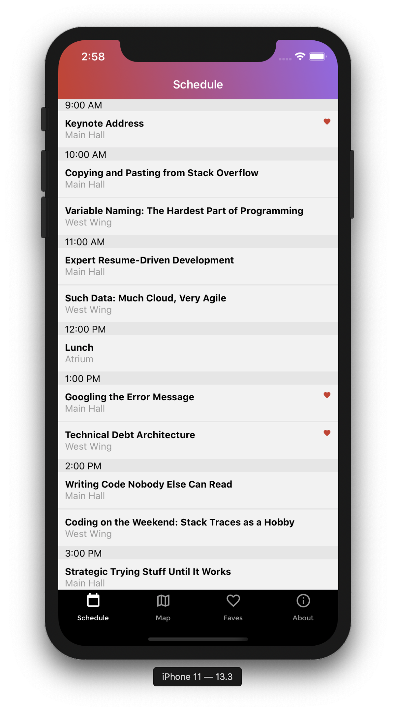
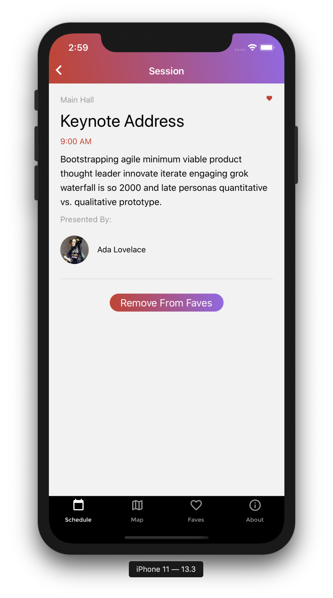
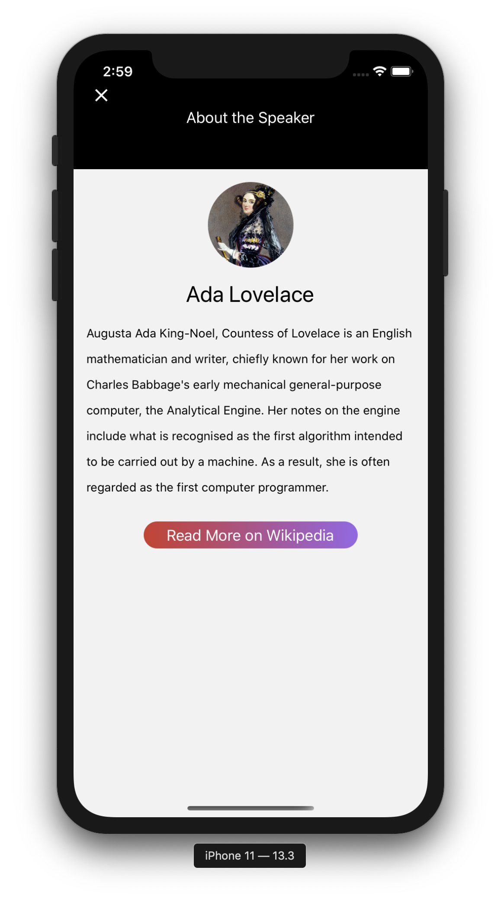
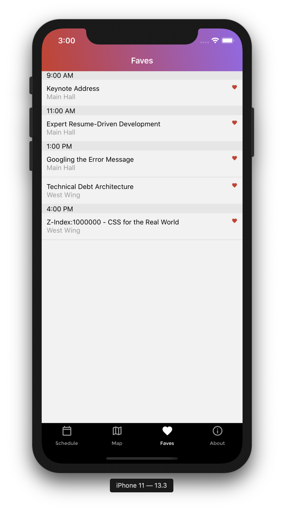
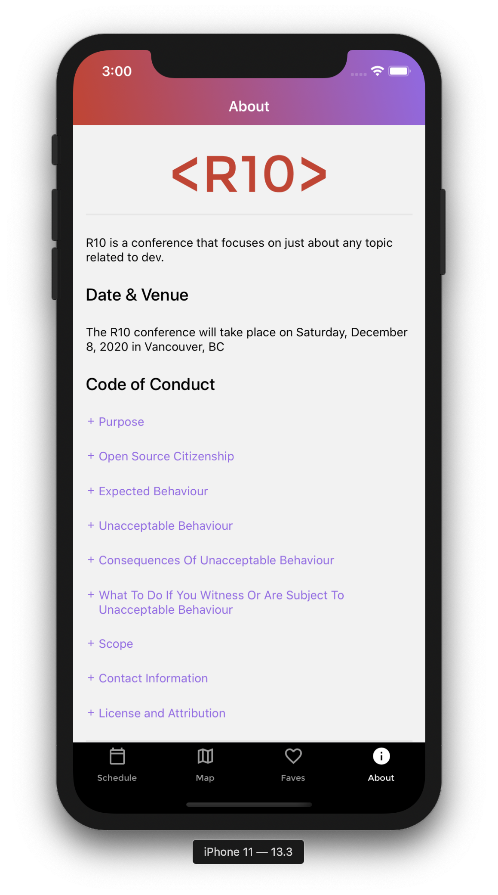
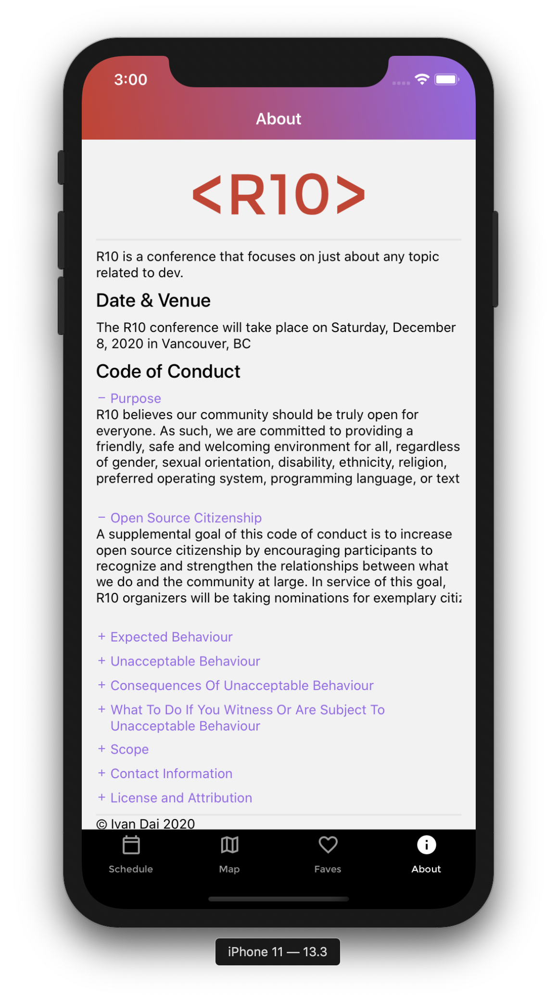

# R10 Conference Application

## Screenshots








## Project Description

The R10 Conference App allows the user to find everything about the conference in one mobile React Native application. The user is able to favourite the select session their interest it and will be able to read up more on the speaker and their content.

### Installation

```bash
yarn install
```

### Run

```bash
yarn ios - IOS Device
yarn android - Android Device
```

## Technologies Used & Key Learnings

- React Native
- GraphQL
- Javascript
- IOS/Android mobile device development
- Mobile App project structure

## Personal Experience/ Learning Objective

Increased understanding on using React Native and GraphQL to develop mobile applications. It was also a chance to understanding further how ReactJS is used.

## Author

- Ivan - https://github.com/Ivandaixiv
